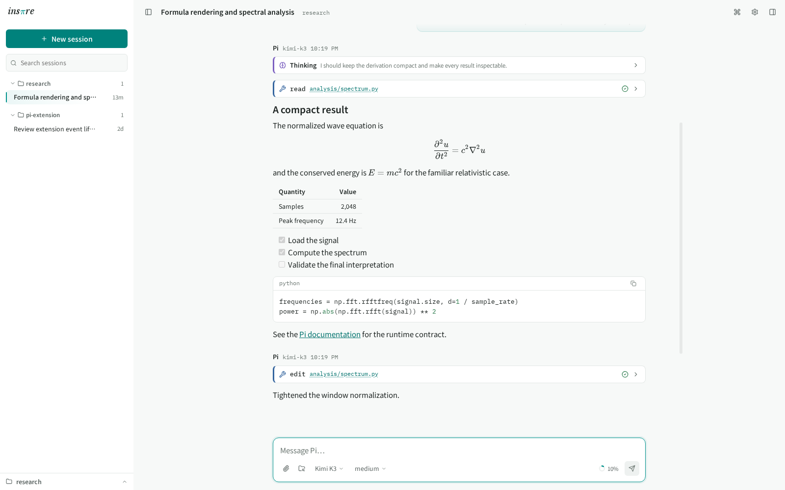
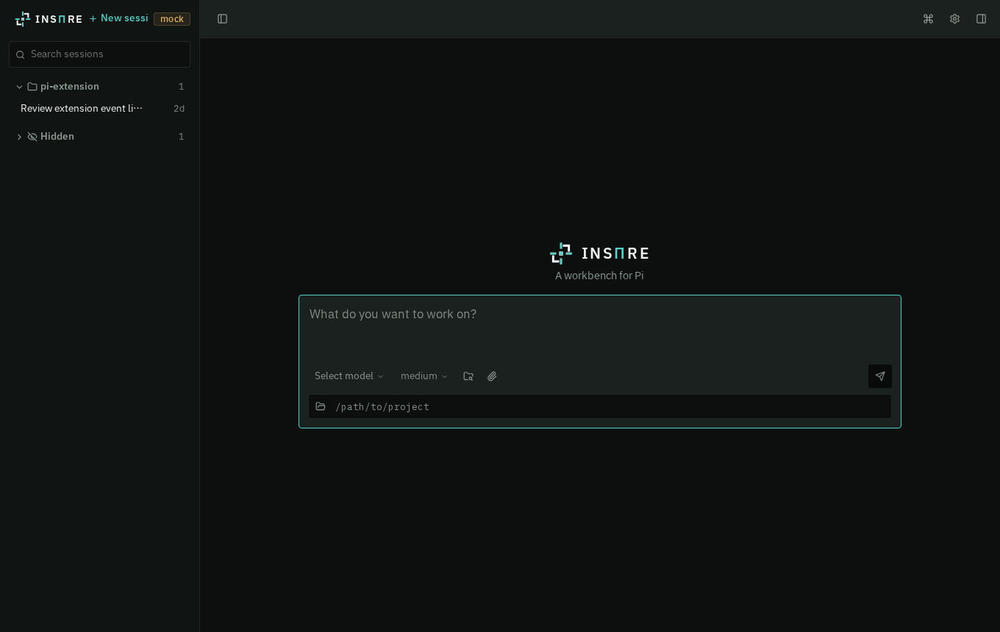
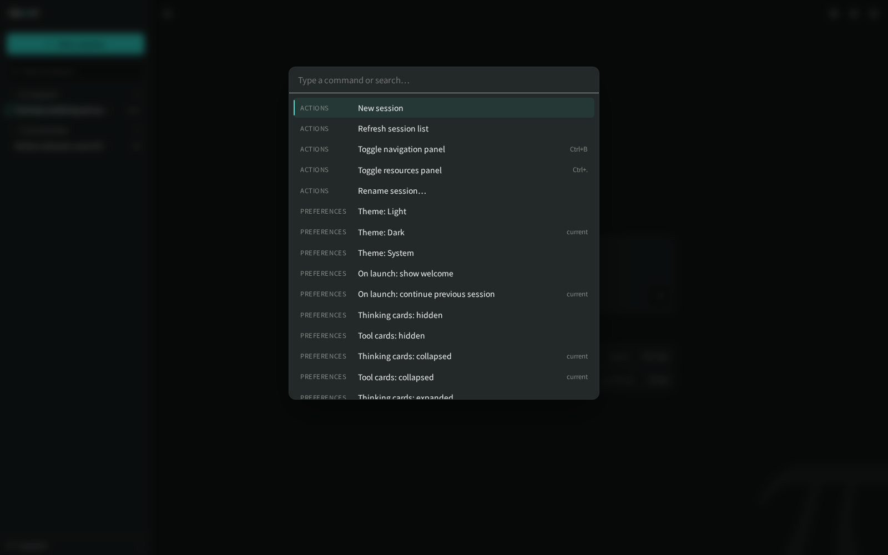
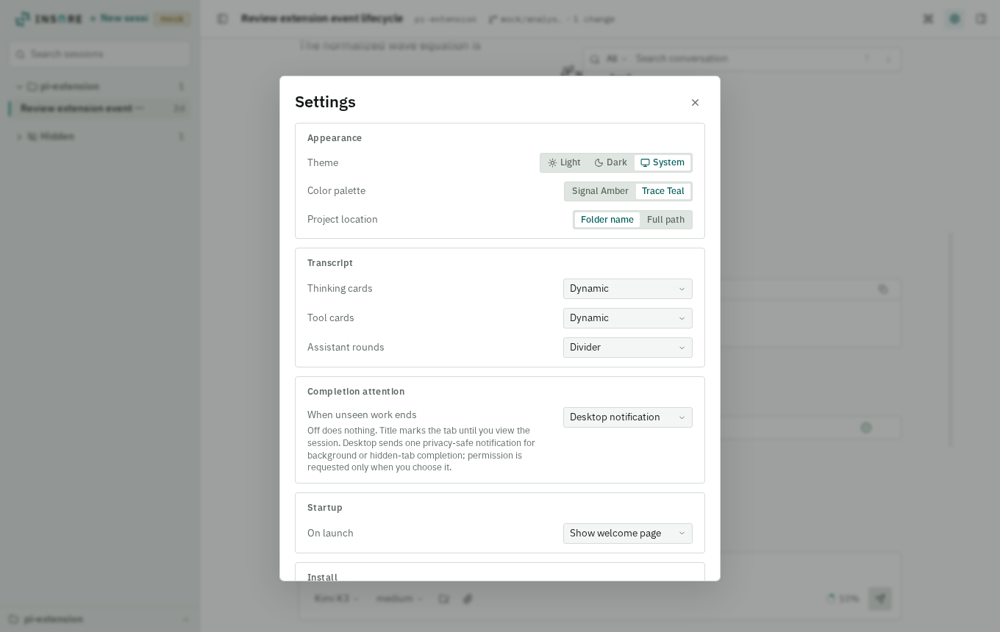
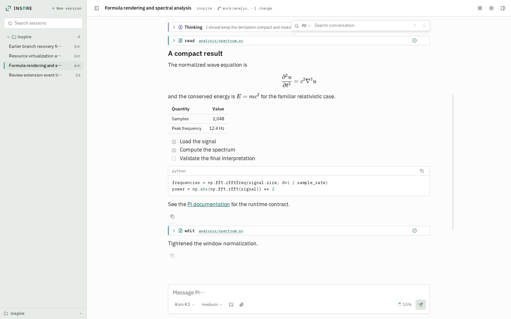
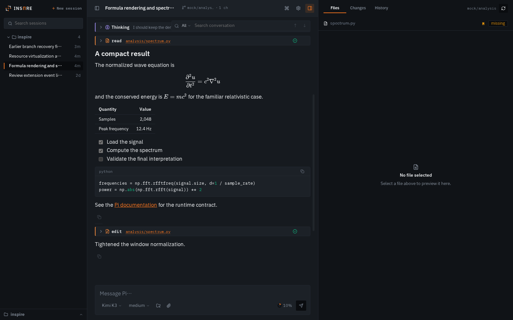
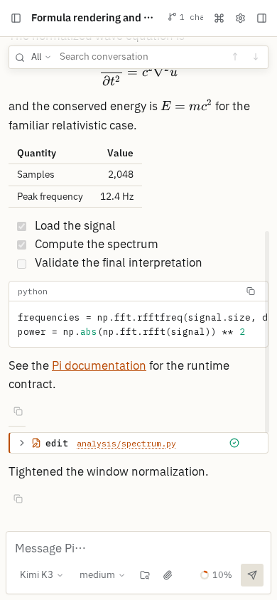

# INSΠRE

A cross-platform local workbench for [Pi Coding Agent](https://github.com/earendil-works/pi). **INSΠRE** is the visual lockup; *Inspire* is the product name in prose, reflecting both *inspire* and *inspect Pi rendering*. Inspire keeps Pi as the runtime and session authority while making conversations, activity, and files easier to inspect — streaming Markdown and mathematics, session navigation, tool and thinking cards, and file-aware input, in a scientific-workbench interface.

<picture>
  <source media="(prefers-color-scheme: dark)" srcset="docs/screenshots/conversation-dark.png">
  
</picture>

## What you get

- **Pi underneath, unchanged.** Sessions are real Pi sessions running under Pi's own runtime. Inspire creates no parallel conversation database: refresh or reconnect and the visible state is rebuilt from Pi's session records.
- **Rich defensive rendering.** One Markdown pipeline covers both streaming and settled text — headings, tables, task lists, links, syntax-highlighted code, and KaTeX inline and display mathematics — rendered defensively, so untrusted model output cannot inject markup or fire network requests.
- **Session navigation that respects running work.** Find, open, continue, rename, and switch sessions; pin or hide both sessions and project folders; restore hidden work from one reversible group. Multiple sessions run concurrently under independent Pi runtimes, and navigating away never stops background work — the navigation distinguishes running, unseen success, and unseen error. On narrow screens the same navigation becomes an off-canvas drawer instead of compressing the conversation.
- **A complete composer.** Text, searchable project-file references, pasted or dropped images, and ordinary file attachments, plus steering messages and follow-ups while a run is active. Model and thinking-level pickers use your existing Pi configuration.
- **Adaptive activity cards.** Thinking and tool activity render as distinguishable, inspectable cards with file links and status. The default Adaptive mode keeps current work visible, compacts settled activity, and collapses completed groups at the next response boundary; activity-group density also offers fixed Expanded, Compact, and Collapsed choices independently of reasoning and tool-card detail.
- **Session-bound file previews.** Files referenced by Pi messages or tool activity open beside the conversation as defensive previews — images, HTML, PDF, and text/code — without granting the browser arbitrary filesystem access.
- **A workbench, not a chat page.** Collapsible navigation, a contextual resources panel, a command palette with keyboard accelerators, and a coherent light-and-dark design system (IBM Plex Sans SC for interface, reading, and the INSΠRE wordmark; Flux Mono SC for code and CJK-aligned data).

<table>
  <tr>
    <td></td>
    <td></td>
    <td></td>
  </tr>
  <tr>
    <td align="center"><em>Welcome screen — start work in any project directory</em></td>
    <td align="center"><em>Command palette — every action a keystroke away</em></td>
    <td align="center"><em>Settings — theme, card defaults, launch behavior</em></td>
  </tr>
</table>

### Additional current surfaces

<table>
  <tr>
    <td></td>
    <td></td>
    <td></td>
  </tr>
  <tr>
    <td align="center"><em>Jade palette</em></td>
    <td align="center"><em>Resources</em></td>
    <td align="center"><em>390px mobile workbench</em></td>
  </tr>
</table>

## Run locally

Requirements: Node.js 22.19 or newer and a separately installed Pi available as `pi` on `PATH` (normally `npm install -g --ignore-scripts @earendil-works/pi-coding-agent`). Inspire loads the public SDK and starts RPC workers from that same Pi package, so the terminal and web workbench use one runtime installation and the same `~/.pi/agent/` state.

Inspire supports the latest Pi release; the exact version pinned in `devDependencies` (currently 0.84.2) is the deterministic witness for that boundary. Older Pi versions may still work but are neither tested nor supported, and Inspire does not carry compatibility branches for them. Startup verifies that the resolved CLI and SDK belong to one external Pi package. Missing runtime capabilities are recorded as `runtime_capability_unavailable` in the private diagnostics log, and unsupported response-bearing extension UI fails explicitly instead of leaving the extension waiting.

The same npm entry works in a source checkout on Linux, macOS, and Windows:

```bash
npm run inspire
npm run inspire -- status
npm run inspire -- restart
npm run inspire -- stop
npm run inspire -- mock
npm run inspire -- dev
npm run inspire -- build
```

On Linux and macOS, `./inspire` is an equivalent convenience wrapper. A globally installed package exposes the ordinary `inspire` command on every supported OS.

Without an installed Linux host user service, the launcher installs dependencies if needed, builds the client when missing, starts the loopback host, and opens the browser with the one-time launch token. Running it again is idempotent: a healthy instance from the same installation is reused and reopened rather than replaced.

The launcher never kills an arbitrary process merely because it owns the configured port. Reuse and normal shutdown require private instance state plus an authenticated health or shutdown request. Linux retains an exact `/proc`-verified signal fallback for an unhealthy managed Host; macOS and Windows fail closed when that authenticated Host cannot answer. An unrelated or legacy occupant is reported with a native inspection command instead of being terminated.

### Platform support

| Surface | Linux | macOS | Windows |
| --- | --- | --- | --- |
| Local Host, session runtime, launcher lifecycle | Supported | Supported | Supported |
| Web UI in Chromium | CI tested | CI tested | CI tested |
| Native desktop Trash for session deletion | Freedesktop Trash | `~/.Trash` | Recycle Bin |
| Persistent systemd user service | Supported | Not applicable | Not applicable |
| Reverse-SSH systemd connection module | Supported | Not applicable | Not applicable |

### Persistent Linux host service

The optional persistent service uses Linux systemd. Core lifecycle commands remain available directly on macOS and Windows. On Linux, install and enable the service once:

```bash
./inspire service install-host
./inspire service enable-host
```

After that, the same launcher commands delegate to the matching `inspire-host.service`; no `systemctl` syntax is needed. The service is verified against the current checkout before delegation, and a checkout without that service continues to use direct-launcher mode.

Equivalent npm entry points remain available (`npm start`, `npm run start:mock`, `npm run dev`). On first use the launcher passes a one-time bearer to the browser, which exchanges it for an origin-scoped `HttpOnly`, `SameSite=Strict` cookie and removes the bearer from the URL. Later launches for the same checkout, host, and port reuse the private persisted host token; the browser never stores that bearer durably in JavaScript. Generated tokens contain 48 cryptographic random bytes, encoded as 64 base64url characters (384 bits); earlier generated token lengths rotate on the next host start.

## Extensions and light customization

INSΠRE remains neutral toward third-party Pi Extensions: commands, tools, dialogs, notices, statuses, and serializable text widgets use generic Pi RPC projections, while terminal-only component factories do not become Web components. [Adapting Pi Extensions to INSΠRE](docs/extensions.md) provides the compatibility matrix, dual TUI/Web recipes for Todo and usage displays, semantic placement and visual rules, source-level customization boundaries, and a verification checklist.

## Custom tool presentations

Pi's native tools use shared rich presentation rules. Custom tools can add local data-only rules and exact tool-name mapping overrides in an ignored user configuration file; incompatible rules fall directly back to the generic raw card. See [Custom tool presentations](docs/tool-presentations.md) for locations, resolution, and the declarative block format.

## SSH reverse connection

The optional Linux-only `ssh-reverse` connection module opens a loopback-only reverse SSH tunnel from the local host to a user-controlled HTTPS edge. It is separate from the cross-platform core Host lifecycle and may be started, inspected, stopped, or installed as a systemd user service independently. The examples use the installed command; use `./inspire` in a source checkout.

```bash
inspire connection ssh-reverse init
inspire connection ssh-reverse start
```

See [the SSH reverse connection guide](docs/ssh-reverse.md) for local configuration, automatic recovery, and a minimal server-side HTTPS proxy example. The module is personal shared-token access, not multi-user collaboration or device-level authorization.

## Release package

INSΠRE is packaged as a standalone npm CLI application, not as a Pi resource package: it intentionally has no `pi` manifest or `pi-package` keyword and does not bundle a second Pi runtime. Pi Coding Agent is a development dependency for type-checking and compatibility tests; an installed release resolves the user's external Pi package as its sole SDK and RPC authority.

```bash
npm run release:verify
npm pack
```

`prepack` builds the browser client and compiled Node host. The verifier requires npm's canonical cross-platform `inspire.mjs` bin metadata, checks the exact tarball through `npm publish --dry-run`, installs it with production dependencies only, proves that Pi is absent from that installation, confirms that required assets are present while tests and TypeScript source are absent, exercises the installed JavaScript CLI through mock `start`, `status`, authenticated health, and `stop`, then uses one separately installed Pi package for both the public SDK and a real RPC worker and creates an empty session without invoking a model. CI repeats this packaged lifecycle on Linux, macOS, and Windows.

No prebuilt release is currently published. To install from a source checkout, verify and pack the same standalone application locally:

```bash
npm ci
npm run release:verify
npm pack
npm install --global ./inspire-pi-gui-0.3.0.tgz
inspire
```

A bare `npm install --global inspire-pi-gui` is not an installation path unless a later release is explicitly published to the npm registry.

## Development

```bash
npm run dev
```

On Unix, `./inspire dev` is equivalent. Development uses a fixed loopback-only token. Production reuses a private checkout/host/port-scoped token unless `INSPIRE_TOKEN` is supplied explicitly; every browser origin must still complete the one-time cookie exchange.

## Diagnostics

The host writes metadata-only structured JSONL diagnostics to the native per-user state directory: `${XDG_STATE_HOME:-~/.local/state}/inspire` on Linux, `~/Library/Application Support/Inspire` on macOS, and `%LOCALAPPDATA%\Inspire` on Windows. Projection-conflict banners include an incident ID that can be matched to these records. Logs correlate the host, slot incarnation, Pi worker/PID, RPC request, projection revision/fingerprint, persistence expectation, and ownership decision; they do not record prompts, tool output, extension payloads, credentials, or raw child stderr. POSIX files are mode `0600` and directories `0700`; Windows uses the current user-profile ACL boundary. Rotation retains five 5 MiB files by default. `INSPIRE_LOG_PATH` may select another file only inside an existing private directory.

## Checks

```bash
npm run check
npm run build
```

`npm run check` combines portable lock/lifecycle tests, TypeScript's unused-symbol checks, Biome lint, architectural import boundaries, Knip's unused entry/export/dependency analysis, the production client build, unit tests, and launcher tests. CI additionally runs the Chromium workbench gate on Linux, macOS, and Windows.

## Privacy

The default deployment is local-only. A deliberately configured personal relay keeps the loopback host as the privileged boundary: provider credentials and unrestricted filesystem access stay in the trusted host process and are never sent to browser storage or the relay's application layer.

## License

[MIT](LICENSE). The release bundle also includes generated third-party software notices at `dist/THIRD_PARTY_NOTICES.txt`; the official IBM Plex font licenses are distributed under `src/assets/licenses/`.
