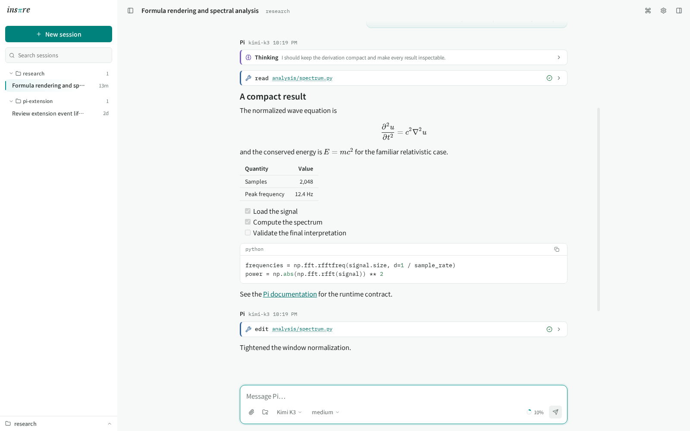
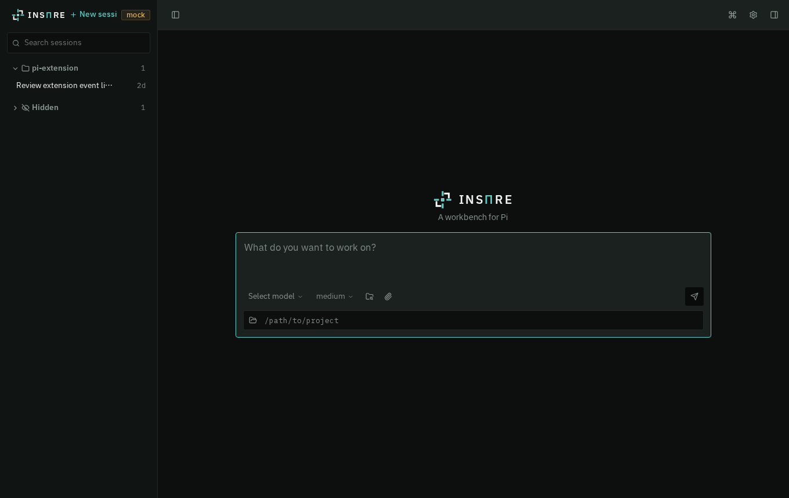
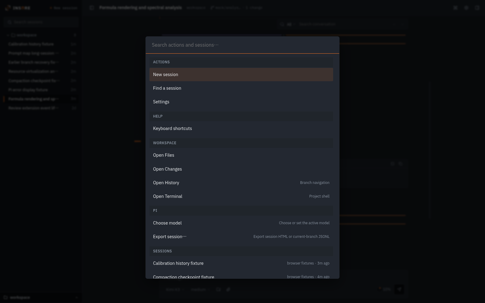
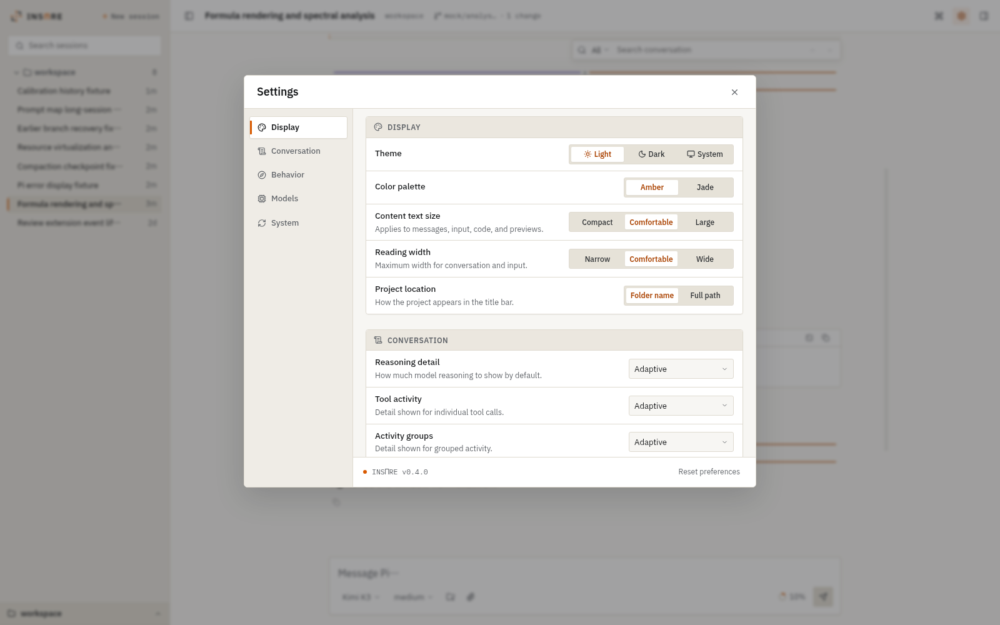
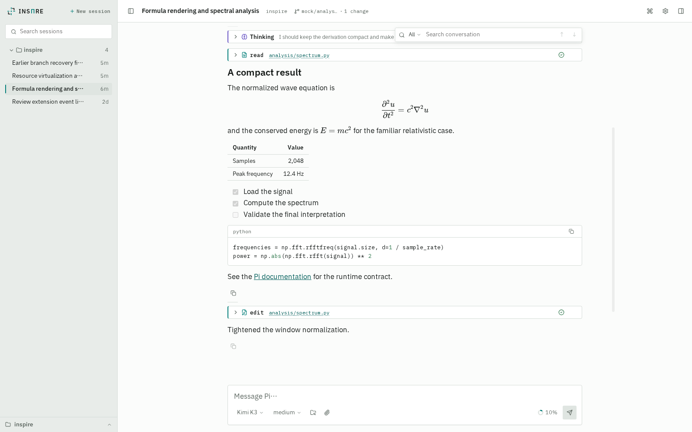
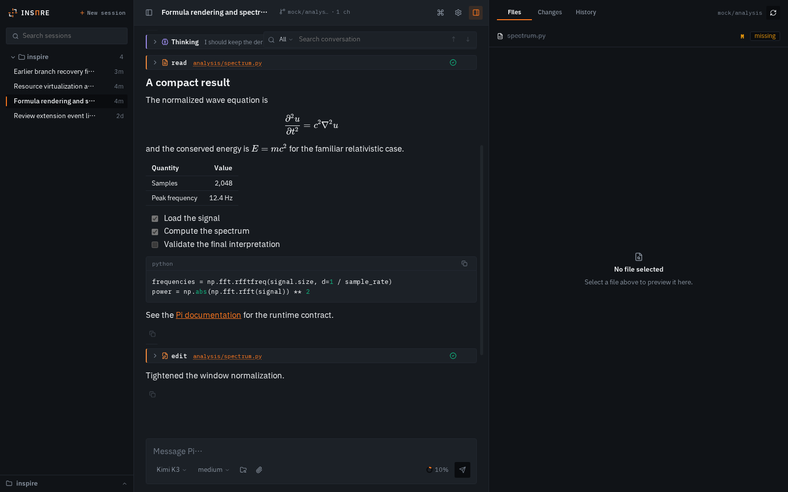
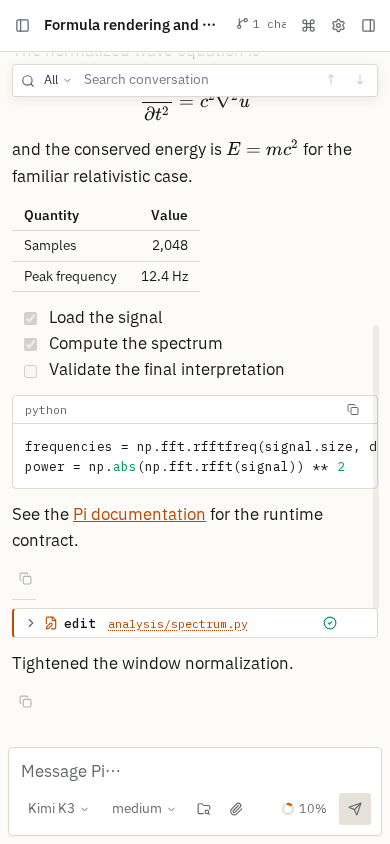

# INSΠRE

Inspire is a local graphical workbench for [Pi Coding Agent](https://github.com/earendil-works/pi): conversations, tool activity, files, and terminals in one interface. It uses your installed Pi, existing configuration, and native session records.

<picture>
  <source media="(prefers-color-scheme: dark)" srcset="docs/screenshots/conversation-dark.png">
  
</picture>

## Features

- **Technical conversations:** streaming Markdown, syntax-highlighted code, tables, and inline/display mathematics, with search and a prompt outline.
- **Concurrent sessions:** search retained conversation text, inspect History, continue branches, and Fork/Clone independent sessions. Switching keeps background work running; navigation shows running work and unseen results.
- **Rich input:** project-file references, images/files, retained drafts and prompt history, plus Steer/Queue with text/image recovery during a run.
- **Native Pi controls:** model/thinking selection, saved defaults/common models, provider configuration/login, direct shell input, compaction, and HTML/JSONL export.
- **Inspectable activity:** live tool output, native and customizable tool cards, and independent Thinking/tool detail settings. Adaptive mode shows current work and compacts completed activity.
- **Files and Changes:** browse the workspace, inspect Git diffs, and preview images, Markdown, notebooks, HTML, PDF, source, audio, and video beside the conversation.
- **Persistent terminals:** project-scoped shell tabs survive browser disconnects and Host-only restarts.
- **Desktop and narrow layouts:** resizable panes, a command palette, keyboard shortcuts, and Amber/Jade light and dark themes.

<table>
  <tr>
    <td></td>
    <td></td>
    <td></td>
  </tr>
  <tr>
    <td align="center"><em>New session</em></td>
    <td align="center"><em>Command palette</em></td>
    <td align="center"><em>Settings</em></td>
  </tr>
  <tr>
    <td></td>
    <td></td>
    <td></td>
  </tr>
  <tr>
    <td align="center"><em>Jade palette</em></td>
    <td align="center"><em>Resources</em></td>
    <td align="center"><em>Narrow layout</em></td>
  </tr>
</table>

## Run locally

Requirements: **Node.js 22.19+** and a separately installed **Pi** available as `pi` on `PATH`:

```bash
npm install -g --ignore-scripts @earendil-works/pi-coding-agent
```

From this checkout:

```bash
npm run inspire
npm run inspire -- status
npm run inspire -- restart
npm run inspire -- stop
```

The launcher installs dependencies and builds the client when needed, starts the loopback Host, and opens the browser. Later launches reuse the matching running instance. On Linux and macOS, `./inspire` is an equivalent wrapper.

Inspire targets the latest Pi release; `package.json` records the version used by development compatibility checks. The running Host loads both the SDK and RPC worker from your external Pi installation, using its normal agent directory and project configuration.

### Platform support

| Capability | Linux | macOS | Windows |
| --- | --- | --- | --- |
| Host, Pi sessions, launcher, project terminals | Supported | Supported | Supported |
| Chromium workbench tests in CI | Yes | Yes | Yes |
| Native session Trash | Freedesktop Trash | `~/.Trash` | Recycle Bin |
| Persistent systemd services | Yes | — | — |
| Herdr enhancement and managed reverse SSH | Yes | — | — |

### Persistent Linux service

```bash
./inspire service install-host
./inspire service enable-host
```

The usual launcher commands then manage that installation's services. Host-only restart preserves terminal tabs; `restart --all` also restarts the terminal service and ends its processes. **Settings → System → Restart** provides the same scopes and asks for confirmation before interrupting Pi work.

See [Running and maintaining Inspire](docs/host.md) for service behavior, shell environments, packaging, and diagnostics.

## Pi commands and customization

- [Pi commands](docs/pi-commands.md): browser controls, compaction/export/reload, and terminal-only commands.
- [Extension adaptation](docs/extensions.md): supported RPC UI, session lifecycle, text-widget recipes, and source customization.
- [Tool presentations](docs/tool-presentations.md): local JSON rules for custom tools and Thinking cards, including exact tool-name overrides.

Tools, prompts, models, credentials, and extensions remain configured in Pi. Tool-presentation files customize the GUI; they do not select which extensions run.

## Remote access and Herdr

[Reverse SSH](docs/ssh-reverse.md) connects a Linux Host to a user-controlled HTTPS edge. The browser and terminal use the same tunnel; Pi, session files, and project processes stay on the Host.

Optional **Settings → Behavior → Herdr enhancement** places Pi workers in Herdr panes while retaining the same GUI. It requires Linux, Herdr, a systemd user manager, and writable cgroup v2 scopes with `cgroup.kill`. The saved choice takes effect after a Host restart.

### Access and trust

Pairing grants full control of the installation, including a shell with the Host user's permissions. Pair only trusted browser profiles and use HTTPS remotely. A remote HTTPS edge can observe application traffic, so it must also be trusted.

Provider credentials stay on the Host. Conversation Markdown is sanitized; HTML previews use sandboxed frames. Local file previews are authorized against the selected session and workspace.

## Development

```bash
npm run dev       # Host and Vite development servers
npm run check     # Formatting, lint, types, build, unit and launcher tests
npm run ci        # Also runs browser tests
```

`npm run inspire -- mock` opens the demonstration workspace; choose a separate `INSPIRE_PORT` if the normal Host is running. Development uses a fixed loopback-only token; normal launches use a private installation-scoped token and browser pairing cookie.

The [design overview](https://github.com/XWIlluDelu/pi-inspire/blob/main/docdoki/spec_abstract.md) links to current contracts and open work. [Host operations](docs/host.md#build-and-install-a-package) covers release packaging.

## License

[MIT](LICENSE). Release builds include third-party notices at `dist/THIRD_PARTY_NOTICES.txt`; bundled font licenses are under `src/assets/licenses/`.
