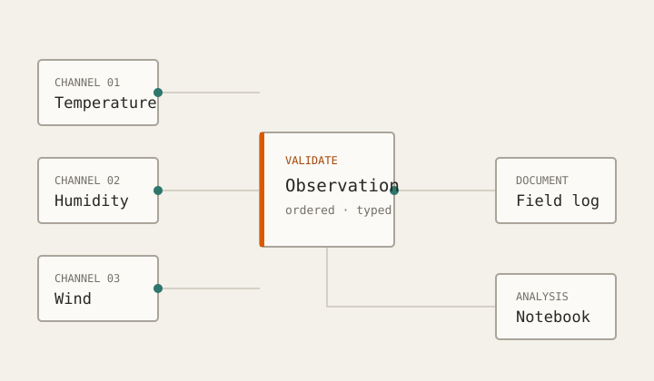

# Training report · image preview

[Results](#results) · [Notebook](document-images.ipynb) · [Companion notes](document.md#interpretation)

## Results

The following figures are synthetic fixtures, not training measurements.

## Unavailable and external images

